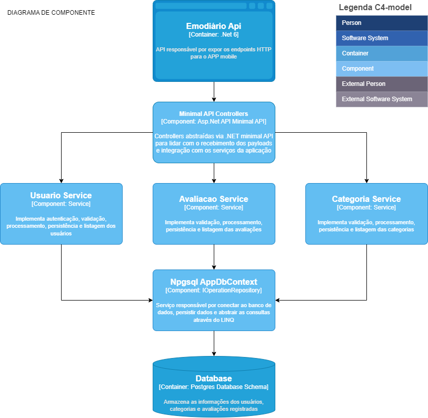

# Documentação da API - V1

## Visão Geral
A API Emodiario é construída usando .NET Core 6.0, utilizando Minimal API e conectando-se a um banco de dados PostgreSQL.

# Diagrama de componente

> [C4Model](https://c4model.com/#ComponentDiagram)



## Funcionalidades
Esta API permite gerenciar criação e autenticação usuários, suas categorias e avaliações.

## Endpoints

### Registro de Usuário

- **URI:** `/api/usuarios`
- **Método:** POST
- **Descrição:** Registra um novo usuário.
- **Request:**
  ```json
  {
    "nome": "string",
    "email": "string",
    "senha": "string",
    "telefone": "string"
  }
  ```
- **Response:**
  ```json
  {
    "id": 1,
    "nome": "string",
    "email": "string",
    "telefone": "string",
    "avaliacoes": []
  }
  ```

### Login de Usuário

- **URI:** `/api/usuarios/login`
- **Método:** POST
- **Descrição:** Autentica um usuário e retorna seus dados.
- **Request:**
  ```json
  {
    "email": "string",
    "senha": "string"
  }
  ```
- **Response:**
  ```json
  {
    "id": 1,
    "nome": "string",
    "email": "string",
    "telefone": "string",
    "avaliacoes": [
      {
        "id": 1,
        "valor": 5,
        "descricao": "string",
        "dataAtualizacao": "2024-01-01T00:00:00",
        "idCategoria": 1,
        "categoria": {
          "id": 1,
          "nome": "string",
          "descricao": "string"
        }
      }
    ]
  }
  ```

### Buscar Usuário por ID

- **URI:** `/api/usuarios/{id}`
- **Método:** GET
- **Descrição:** Retorna os dados de um usuário específico pelo ID.
- **Response:**
  ```json
  {
    "id": 1,
    "nome": "string",
    "email": "string",
    "telefone": "string",
    "avaliacoes": [
      {
        "id": 1,
        "valor": 5,
        "descricao": "string",
        "dataAtualizacao": "2024-01-01T00:00:00",
        "idCategoria": 1,
        "categoria": {
          "id": 1,
          "nome": "string",
          "descricao": "string"
        }
      }
    ]
  }
  ```

### Criar Categoria

- **URI:** `/api/usuarios/{idUsuario}/categorias`
- **Método:** POST
- **Descrição:** Cria uma nova categoria para um usuário específico.
- **Request:**
  ```json
  {
    "nome": "string",
    "descricao": "string"
  }
  ```
- **Response:**
  ```json
  {
    "id": 1,
    "nome": "string",
    "descricao": "string"
  }
  ```

### Buscar Categorias do Usuário

- **URI:** `/api/usuarios/{idUsuario}/categorias`
- **Método:** GET
- **Descrição:** Retorna as categorias associadas às avaliações de um usuário específico pelo ID do usuário.
- **Response:**
  ```json
  [
    {
      "id": 1,
      "nome": "string",
      "descricao": "string"
    }
  ]
  ```

### Criar Avaliação

- **URI:** `/api/categorias/{idCategoria}/avaliacoes`
- **Método:** POST
- **Descrição:** Cria uma nova avaliação para uma categoria específica.
- **Request:**
  ```json
  {
    "valor": 3,
    "descricao": "string"
  }
  ```
- **Response:**
  ```json
  {
    "id": 1,
    "valor": 3,
    "descricao": "string",
    "dataAtualizacao": "2024-01-01T00:00:00",
    "idCategoria": 1,
    "categoria": {
      "id": 1,
      "nome": "string",
      "descricao": "string"
    }
  }
  ```

### Buscar Avaliações por Categoria

- **URI:** `/api/categorias/{idCategoria}/avaliacoes`
- **Método:** GET
- **Descrição:** Retorna as avaliações de uma categoria específica pelo ID da categoria.
- **Response:**
  ```json
  [
    {
      "id": 1,
      "valor": 5,
      "descricao": "string",
      "dataAtualizacao": "2024-01-01T00:00:00",
      "idCategoria": 1,
      "categoria": {
        "id": 1,
        "nome": "string",
        "descricao": "string"
      }
    }
  ]
  ```
